# 🚀 Yogesh Sharma 
<div align="center">


[](https://yogesh.social)
[](https://github.com/yopilot)
[](https://www.linkedin.com/in/yopilot/)
[](mailto:connectoyogesh@gmail.com)


</div>

---

## 🌟 About Me

> *"Crafting intelligent solutions at the intersection of code and creativity"*

```typescript
const yogesh = {
    role: "Full-Stack Developer & AI Enthusiast",
    location: "Chennai, India 🇮🇳",
    education: "B.Tech Computer Science @ VIT",
    passion: ["Artificial Intelligence", "Machine Learning", "Problem Solving"],
    currentFocus: "Building AI-powered applications that solve real-world problems",
    funFact: "Chess.com 97th percentile (1700 rating) ♟️",
    philosophy: "Code with purpose, innovate with passion"
};
```

<div align="center">

</div>

---

## 🏗️ Featured Projects

<table>
<tr>
<td width="50%">

### 🤖 Social-E-Motion
*Advanced NLP-powered Social Media Analytics Platform*

[](https://github.com/yopilot/Beyond)

**🎯 Impact:**
- 📈 45% improvement in behavior tagging accuracy
- ⚡ 30% reduction in data processing time
- 🎨 Full-stack application with modern UI

**Tech Arsenal:**
`Python` `Next.js` `REST APIs` `Prisma` `NLP` `Reddit API`

</td>
<td width="50%">

### 📋 Nex.us - Smart Recruiter
*AI-Powered Resume & Job Matching Platform*

[](https://github.com/yopilot/NexusFull)

**🎯 Impact:**
- 🎯 60% boost in matching accuracy
- ⏱️ 35% reduction in screening time
- 🚀 Streamlined hiring process

**Tech Arsenal:**
`React` `Node.js` `AWS` `RESTful APIs` `ML Algorithms`

</td>
</tr>
</table>

### 🔐 Digital Signature Solution *(Freelance Project)*
*Secure Web & Desktop Signature Management System for NZESSENTIALS*

<div align="center">


</div>

**Key Features:**
- 🔒 Secure signature capture & storage
- 🖥️ Cross-platform desktop application
- 🌐 RESTful API integration
- ✅ Digital signature verification

---

## 🧠 Research & Publications

<div align="center">

### 📚 IEEE Conference - ICCCNT 2025
*Co-Author | Research Paper Publication*


**Research Focus:** *Two-Stage Prompting Pipeline for Mermaid Diagram Generation*

</div>

**🔬 Research Highlights:**
- 🤖 Leveraged Gemini Pro for advanced text-to-diagram conversion
- 📊 Achieved 30+ % performance improvement through prompt optimization
- 📈 Created high-quality synthetic dataset for training
- 🎯 Advanced the field of AI-assisted diagram generation

---

## 💻 Technical Arsenal

<div align="center">

### 🚀 Programming Languages


### 🎨 Frontend Development


### 🔧 Backend & Cloud


### 🤖 AI/ML & Data Science


### 🗄️ Databases & Tools


</div>

---

## 🏆 Achievements & Certifications

<div align="center">

<table>
<tr>
<td align="center" width="25%">

<br><strong>VIT Top Coder</strong>
<br><small>Selected from 9,000+ students</small>
</td>
<td align="center" width="25%">

<br><strong>C5i Hackathon</strong>
<br><small>Top 10 Finalist (70+ teams)</small>
</td>
<td align="center" width="25%">

<br><strong>Head Content Writer</strong>
<br><small>The Comedy Club</small>
</td>
<td align="center" width="25%">

<br><strong>Chess Champion</strong>
<br><small>97th Percentile (1700 rating)</small>
</td>
</tr>
</table>

### 📜 Certifications


</div>

---

## 📊 GitHub Analytics

<div align="center">


</div>

<div align="center">


</div>

### 🔥 Contribution Graph
<div align="center">


</div>

---

## 🎯 Current Focus Areas

```mermaid
graph TD
    A[🎯 Current Focus] --> B[🤖 AI/ML Applications]
    A --> C[🌐 Full-Stack Development]
    A --> D[📊 Data Science Projects]
    A --> E[🔬 Research & Publications]
    
    B --> F[NLP Solutions]
    B --> G[Computer Vision]
    B --> H[RAG Systems]
    
    C --> I[React/Next.js Apps]
    C --> J[Node.js APIs]
    C --> K[Cloud Deployment]
    
    D --> L[Predictive Modeling]
    D --> M[Data Visualization]
    D --> N[Analytics Dashboards]
    
    E --> O[IEEE Publications]
    E --> P[Open Source Contributions]
    E --> Q[Technical Blogging]
```

<div align="center">



</div>

---

## 🌍 Connect & Collaborate

<div align="center">

 **Let's build the future together!** 

<br><br>

[](https://yogesh.social)
[](https://github.com/yopilot)
[](https://www.linkedin.com/in/yopilot/)
[](mailto:connectoyogesh@gmail.com)

### 💬 Open for:
- 🚀 **Exciting Project Collaborations**
- 🤖 **AI/ML Research Opportunities**
- 💼 **Full-Stack Development Roles**
- 🎯 **Freelance Projects**
- ☕ **Tech Discussions over Coffee**

</div>

---

<div align="center">

### ⚡ Fun Fact
*I debug code faster than I solve chess puzzles, but both require the same strategic thinking!*


**"Code is poetry, AI is the future, and chess is life!"** ♟️

---

<sub>💖 Crafted with passion and a lot of ☕ by Yogesh Sharma</sub>


</div>
